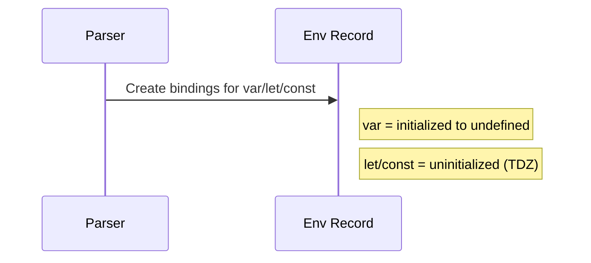

# 📦 Chapter 2: Variables and Data Types - The Foundation

## 🔧 Core Language Concepts

### 📋 Variable Declaration Deep Dive: var vs let vs const
```javascript
console.log(x); // undefined (var is hoisted and initialized)
var x = 1;

// console.log(y); // ReferenceError (TDZ)
let y = 2;
const z = 3; // must be initialized
```

### ⬆️ Hoisting and TDZ
```javascript
function demo() {
  // TDZ for `a` until initialized
  // console.log(a); // ReferenceError
  let a = 10;
  console.log(a);
}
demo();
```

### 💾 Data Type Internals
- Primitives: number, string, boolean, null, undefined, symbol, bigint (immutable)
- Objects: arrays, functions, plain objects (reference semantics)

### 🔍 Type Checking Methods
```javascript
console.log(typeof 1);                   // 'number'
console.log(Array.isArray([]));          // true
console.log({}.toString.call(new Date)); // '[object Date]'
```

## 🧠 Deep Dive: Hoisting and TDZ internals
- Declarations are hoisted during creation phase; `var` gets initialized to `undefined`, `let/const` are uninitialized (TDZ) until execution reaches the binding.
- `const` requires initialization at declaration.
- Function declarations are hoisted with their body; function expressions are not.



### Visual: Creation vs Execution Phases (Scope & Bindings)
```mermaid
flowchart TD
  subgraph Creation Phase
    V[var x = undefined]
    L[let y: <uninitialized>]
    C[const z: <uninitialized>]
    F[function decl: hoisted with body]
  end
  subgraph Execution Phase
    VX[x = 1]
    LY[y = 2]
    CZ[z = 3]
  end
  V --> VX
  L --> LY
  C --> CZ
  F -->|callable| Execution Phase
```

## ⚠️ Pitfalls and Gotchas
- Accessing `let/const` before initialization throws (TDZ).
- `const` protects the binding, not the object it references.
- Shadowing can hide outer variables; use clear naming.

Common pitfalls clarified
- Reassignment vs mutation with `const`:
  - `const obj = { a: 1 }; obj.a = 2; // ok`
  - `obj = {}; // TypeError: Assignment to constant variable`
- Function expressions vs declarations:
  - `fn(); const fn = () => {} // ReferenceError (TDZ for fn)`
  - `decl(); function decl(){} // ok (hoisted)`
- Temporal Dead Zone example: any read of `let/const` before the binding executes is a runtime error, even inside typeof in modern engines: `typeof a; let a; // ReferenceError`

## 🧪 Try it yourself
```javascript
// 1) TDZ
// console.log(a); let a = 1;
// Fix: move the log below the declaration.

// 2) const with objects
const settings = { theme: 'light' };
settings.theme = 'dark'; // ok (mutating object)
// settings = {} // TypeError (rebind)

// 3) typeof null
console.log(typeof null); // 'object' (historical quirk)

// 4) Predict the output (hoisting + TDZ)
try {
  console.log(x, y); // x? y?
} catch (e) { console.log('Error for y:', e.name); }
var x = 10;
let y = 20;
console.log('After init:', x, y);

// 5) Declarations inside blocks
{
  var a = 1;
  let b = 2;
}
console.log('a:', a);     // ?
try { console.log('b:', b); } catch (e) { console.log('b error:', e.name); }
```

## 🤖 Automation Project: Type-Aware Data Extractor (v1)
- Build a function that extracts values from unknown inputs with stable type checks.

```javascript
// projects/type-aware-extractor.js
export function typeOf(value) {
  const raw = Object.prototype.toString.call(value); // e.g., [object Date]
  return raw.slice(8, -1).toLowerCase();
}

export function extract(input) {
  const t = typeOf(input);
  switch (t) {
    case 'array':
      return input.map(extract);
    case 'date':
      return input.toISOString();
    case 'object':
      return Object.fromEntries(Object.entries(input).map(([k, v]) => [k, extract(v)]));
    default:
      return input;
  }
}
```

## 📁 Folder layout (Chapter 2)
- `examples/` hoisting.js, tdz.js, type-checking.js
- `exercises/` exercise.md
- `projects/` type-aware-extractor.js, demo.js
- `tests/` extractor.test.js
