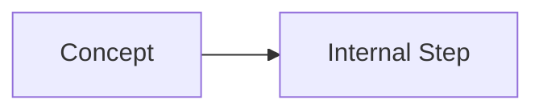

# Chapter ${CHAPTER_NUMBER}: ${CHAPTER_TITLE}

## 🔧 Core Language Concepts
- Brief bullets of core concepts covered.
- Each concept must include a runnable code snippet.

```javascript
// Example runnable snippet
console.log('Hello, Chapter ${CHAPTER_NUMBER}!');
```

## 🧠 Deep Dive
- Explain internals and mental models (e.g., ToPrimitive, execution contexts, GC).
- Include at least one diagram.



## ⚠️ Pitfalls and Gotchas
- Show a failing example and explain precisely why it fails.
- Provide the correct approach.

## 🧪 Try it yourself
- 3–6 short exercises with expected outputs or hints.

## 🤖 Automation Project
- Name: ${PROJECT_NAME}
- Summary of what it does and how it ties to chapter concepts.

```javascript
// demo.js (runnable)
import { ${PROJECT_CLASS} } from './projects/${PROJECT_FILE}.js';

const demo = async () => {
  const instance = new ${PROJECT_CLASS}();
  console.log('Demo:', await instance.run?.());
};

demo();
```

## 📁 Folder layout
- `examples/` minimal runnable samples
- `exercises/` prompts + skeletons
- `projects/` main project code + demo
- `tests/` minimal tests for examples/project
